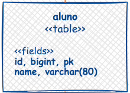
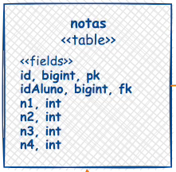

<h1>API-Postgres-Python</h1>
<h3>API desenvolvida com Python utilizando o flask, para o cadastro de estudantes em uma base de dados Postgresql.</h3>

 
<h2>Ferramentas</h2>
    <ul align="left">
        <li>Python</li>
        <li>Flask</li>
        <li>Psycopg2</li>
        <li>Postgresql</li>
    </ul>

 
<h3>Requisitos necessários para rodar o projeto</h3>
 

    Precisa ter o postgresql, flask e o driver Psycopg2 para rodar o projeto

 

    Necessitasse criar um banco de dados e fazer a conexão com ele na linha 4 do arquivo conn.py, o banco de dados deve ser criado com o nome notas.
 
 
<h4>Tabelas do Banco de Dados<h4>

